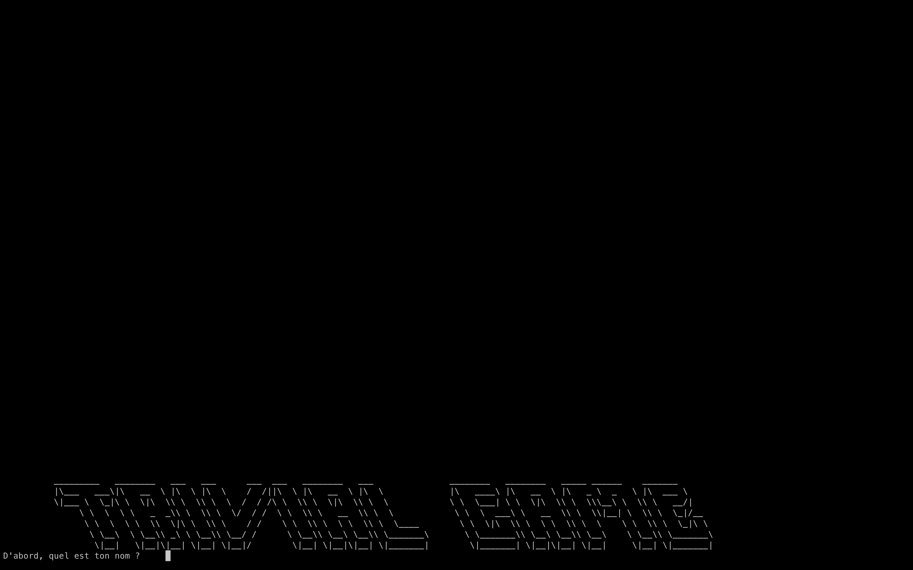
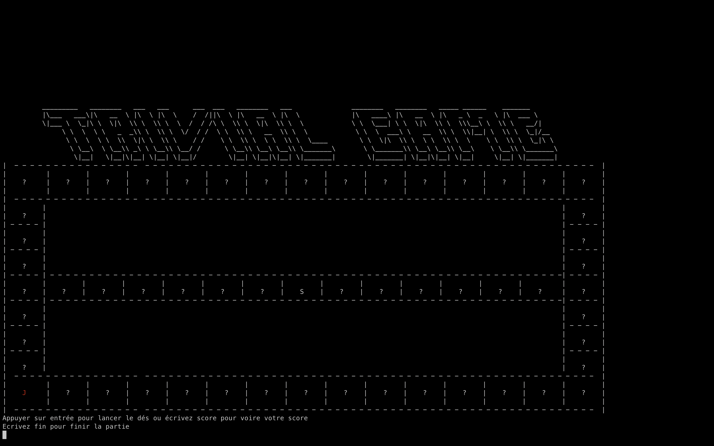
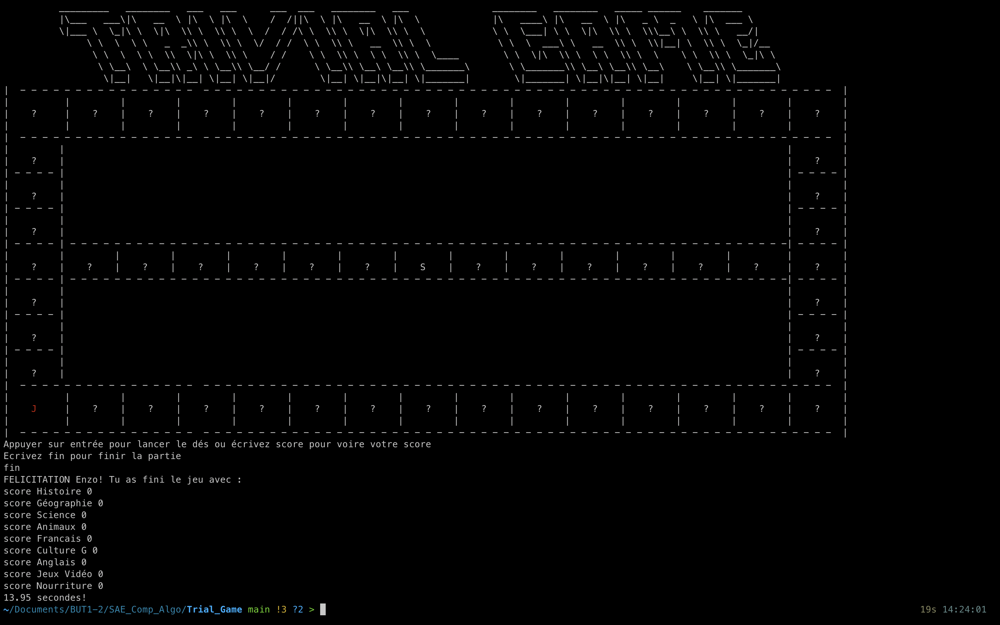
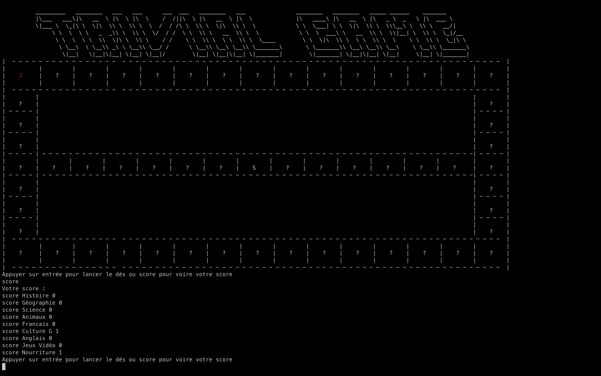
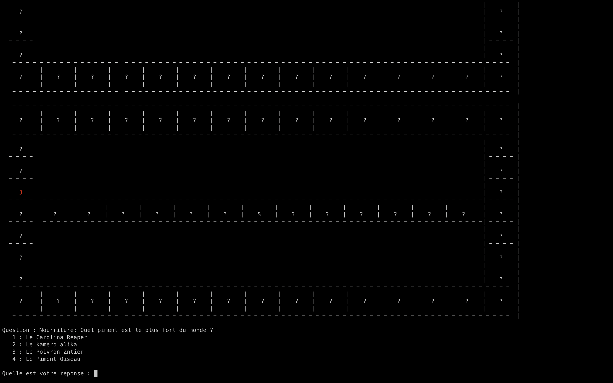
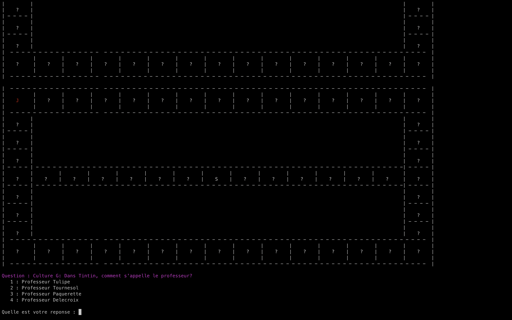
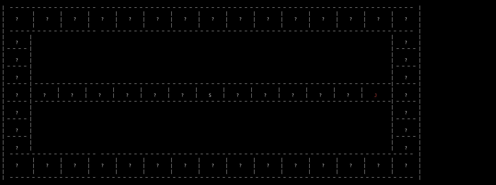
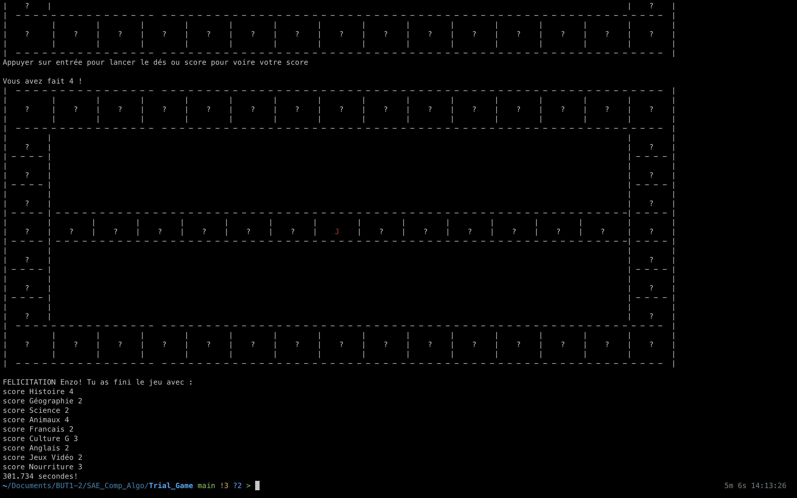

Trivial Game
===========

Développé par Lamour Enzo et Zhang Dylan
-- 
Contacts : <enzo.lamour.etu@univ-lille.fr> , <dylan.zhang@univ-lille.fr>

# Présentation de <le Trivial Game> Trivial Game 

### Le but du jeu est de répondre à des questions et de réussir à arriver à la case sortie pour ce faire, vous aurez besoin de répondre à au moins une question par thème.
---
### Menu du jeu ou on peut rentrer le nom du joueur qui sera ensuite enregistré avec le score.

 

### Après avoir rentré votre nom, le jeu vous proposera :

- sois d'appuyer sur entrer pour lancer le dé.
- sois d'écrire score pour avoir votre score.
- sois d'écrire fin pour arrêter la partie.

 

### Si vous décidez d'arrêter la partie, le jeu finira la partie.

 

### Si vous décidez de voir votre score, le jeu affichera le score.

 

### Si vous appuyez sur entré le jeu lancera un dé et vous posera une question.

 

### La couleur du thème s'affichera avec la question.

 

### Si vous arrivez à avoir un point dans chaque catégorie alors vous pourrez accéder au milieu du plateau qui vous permettra de finir le jeu.

 

### Si vous arrivez sur la case de sortie alors le jeu prendra fin et mettra votre score dans un csv créé à cet effet.

 

# Utilisation de <le nom de votre jeu> Trivial Game

Afin d'utiliser le projet, il suffit de taper les commandes suivantes dans un terminal :

```
./compile.sh
```
Permet la compilation des fichiers présents dans 'src' et création des fichiers '.class' dans 'classes'

```
./run.sh
```
Permet le lancement du jeu
